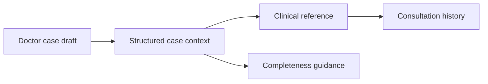
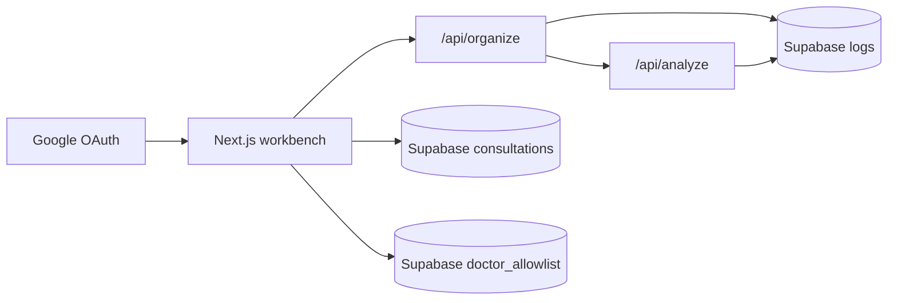

# TCM Diagnosis

Doctor-facing TCM clinical workbench for turning rough case notes into structured clinical context, supportive review guidance, and reusable consultation history.

The product is designed for practical outpatient use: help doctors capture what matters, surface what is worth keeping in mind, and review treatment thinking in a calm, repeatable way.

让医生看得更全，记得更准，面对难题时不再孤单。

---

## What It Helps With

1. Doctors sign in with Google and enter the protected workbench.
2. A case draft is pasted or edited in free form.
3. The system organizes the draft into structured clinical context.
4. The system highlights completeness guidance before or alongside analysis.
5. DeepSeek generates a simplified-Chinese clinical reference.
6. Consultation history can be saved, renamed, reopened, edited, regenerated, and deleted.

---

## Stack And Architecture

| Layer | Technology |
|---|---|
| Web app | Next.js + TypeScript on Vercel |
| UI | Custom CSS + lucide-react |
| AI | DeepSeek via server routes |
| Auth | Supabase Google OAuth + doctor allowlist |
| Data | Supabase JSONB consultation records + API/error logs |
| Validation | Zod + focused clinical guardrails |
| Reliability | Two-step pipeline, JSON repair fallback, defensive mapping |
| Checks | Vitest + production build |

---

## Backend API Routes

| Route | Purpose |
|---|---|
| `POST /api/organize` | Organize a doctor draft into structured case data and completeness guidance. |
| `POST /api/analyze` | Generate structured clinical reference output. |
| `GET /api/consultations` | List consultation history for the logged-in doctor. |
| `POST /api/consultations` | Create a consultation record. |
| `GET /api/consultations/[id]` | Read one owned consultation record. |
| `PATCH /api/consultations/[id]` | Rename, edit, store organized/analyzed JSON, and update status. |
| `DELETE /api/consultations/[id]` | Delete one owned consultation record. |
| `GET /auth/callback` | Complete Google OAuth and doctor allowlist check. |
| `GET /auth/signout` | Sign out and return to login. |

---

## Current Workflow Notes

- The product uses a two-step AI pipeline: `organize -> analyze`.
- Organize-stage output is surfaced immediately in the workbench and can stop before analysis when hard guardrails fail.
- `POST /api/organize` rejects drafts above 8000 characters before any AI call is made.
- `舌脉与四诊要点` is treated as first-class clinical context in organize and review flows.
- A draft can still proceed without an explicit `医生问题` when the current treatment plan is already clear enough to imply a review intent.
- While the second-stage analysis is running, the lower workspace shows a loading shell so progress remains visible beyond the status panel.
- The dashboard includes an in-app help surface so doctors can review assumptions, minimum input expectations, and workflow behavior without leaving the page.
- A build label is shown in the workbench so deployment status can be checked visually after release.
- Doctors can switch between `智能` and `常规` review modes in the workbench; the preference is stored in local browser storage and defaults to `智能`.
- `智能` favors fuller review depth, while `常规` favors faster stable output.
- When a doctor asks for literature or clinical research support, the current system degrades honestly to经验性复核 and states that external retrieval is not yet connected.
- The analysis dashboard keeps its core section structure stable even when a model returns fewer suggestions, so clinicians do not see key sections randomly disappear.
- Token usage, estimated cost, model metadata, and latency stay internal and are stored for traceability rather than shown in the doctor-facing UI.
- Cost logging follows the actual model tier used for the request so smart/normal comparisons stay trustworthy.
- Doctor allowlist is now read from Supabase when the `doctor_allowlist` table is available, with environment-variable fallback during transition.
- Local development can optionally use a strict dev-only auth bypass with `DEV_AUTH_BYPASS=true` and `DEV_AUTH_EMAIL=...`; the app now hard-fails if that bypass is enabled outside `NODE_ENV=development`.
- Internal agent discipline follows a release-path audit: fresh run, saved-history reload, stage-one block, partial organize, final analysis, docs sync, and build marker verification.
- Local real-doctor draft examples are kept in markdown as a single source of truth for manual copy/paste and future local assessment runs.

---

## Local Development Notes

- Keep Google OAuth for normal usage.
- For local UI iteration only, you may enable:
  - `DEV_AUTH_BYPASS=true`
  - `DEV_AUTH_EMAIL=<allowed doctor email>`
- The bypass still checks the allowlist and never applies in production.
