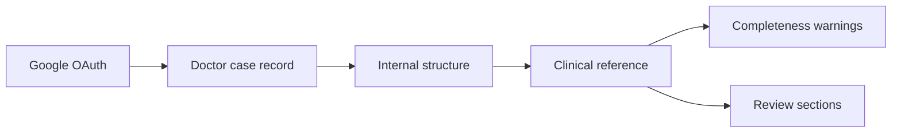
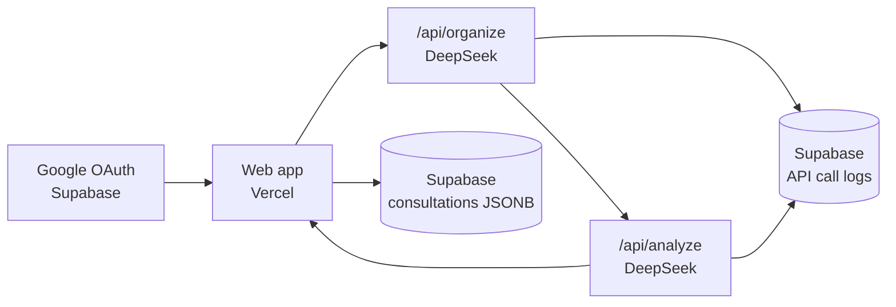

# TCM Diagnosis

Author: Woo Chia Wei  
Repository: [github.com/chiaweiwoo/tcm-diagnosis](https://github.com/chiaweiwoo/tcm-diagnosis)

> Doctor-facing TCM case review workbench · DeepSeek prototype

This project tests whether an AI workflow can help TCM doctors review real clinic notes more consistently. The app is intentionally small: paste a case record, run clinical review, then compare the original note with structured AI output in simplified Chinese.

The focus is practical Singapore clinic use: missing context, realistic treatment complexity, medicine/material availability, safety reminders, and no guaranteed claims.

---

## What It Does

Current flow:

1. Doctor signs in with an allowed Google account.
2. Doctor pastes a case record.
3. DeepSeek organizes the note internally.
4. DeepSeek generates a clinical reference.
5. The page keeps the original note on top and shows the analysis below for comparison.
6. The record can be saved, renamed, reopened, edited, regenerated, or deleted.



The output is grouped for clinical review:

- 资料完整性
- 病案摘要
- 临床判断
- 建议方案
- 复核与随访
- 临床风险

---

## Stack

| Layer | Technology |
|---|---|
| Frontend | Next.js + TypeScript |
| UI | Custom CSS + lucide-react |
| AI | DeepSeek |
| Auth | Supabase Google OAuth + email allowlist |
| Validation | Zod |
| Tests | Vitest |
| Deploy | Vercel |
| Logging | Supabase |

---

## Storage Status

Currently saved:

- doctor email
- optional consultation name
- full doctor draft
- structured extracted case JSON
- final analysis JSON
- raw model analysis JSON
- validation/missing-context JSON
- model metadata JSON
- created/updated/analyzed timestamps
- API route
- provider
- model
- success/failure
- latency
- token usage
- estimated cost
- prompt version
- error message
- small metadata such as case type, draft length, JSON repair status

Not yet saved:

- doctor feedback
- accepted/rejected suggestions

Next database step: add doctor feedback and accepted/rejected suggestion tracking.

---

## Access Control

The workbench is protected by Google OAuth through Supabase.

Allowed doctors are configured with:

```bash
ALLOWED_DOCTOR_EMAILS=chiaweiwoo123@gmail.com,ardytcm@gmail.com
```

Unauthenticated visitors are redirected to `/login`. Signed-in users whose email is not in the allowlist are signed out and shown an authorization message.

---

## Architecture



---

## Backend API Routes

Vercel hosts the backend API routes from the Next.js App Router. Each `src/app/api/**/route.ts` file is deployed as a server route, so DeepSeek and Supabase service-role credentials stay server-side.

| Route | Purpose |
|---|---|
| `POST /api/organize` | Organizes a doctor draft into structured case data with DeepSeek. |
| `POST /api/analyze` | Generates the clinical reference output with DeepSeek. |
| `GET /api/consultations` | Lists consultation history for the logged-in doctor email. |
| `POST /api/consultations` | Creates a consultation record. |
| `GET /api/consultations/[id]` | Reads one consultation record owned by the logged-in doctor. |
| `PATCH /api/consultations/[id]` | Renames, edits, marks stale/ready, and stores JSON analysis data. |
| `DELETE /api/consultations/[id]` | Deletes one consultation record owned by the logged-in doctor. |
| `GET /auth/callback` | Handles Supabase Google OAuth callback and allowlist check. |
| `GET /auth/signout` | Signs out and returns to login. |

Frontend pages/components live under `src/app`, while server-only business routes live under `src/app/api` and `src/app/auth`.

---

## Development

```bash
npm install
npm run dev
npm run test
npm run build
```

DeepSeek smoke test:

```bash
npm run check:deepseek
```

Use checks pragmatically. For UI/routes, `npm run build` is usually enough before push. Run unit tests when validation, JSON handling, or prompt parsing changes.

## Debugging

`supabase/error_logs.sql` stores server errors.

`supabase/api_call_logs.sql` stores model-call performance and cost details. Use this table to compare latency, model choice, token usage, JSON repair frequency, and failed runs.
