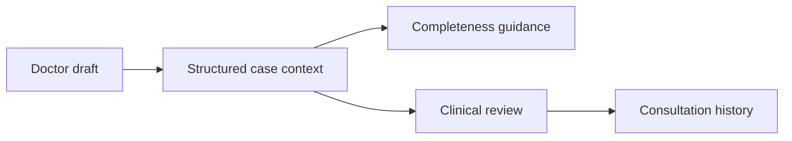
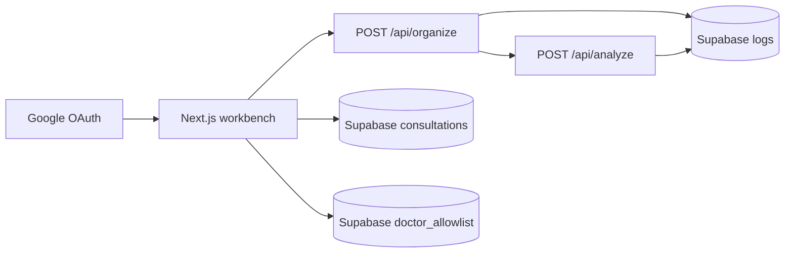

# TCM Diagnosis

Doctor-facing TCM clinical workbench for turning rough case notes into structured clinical context, supportive review guidance, and reusable consultation history.

The product is built for practical outpatient use: help doctors see more completely, remember more accurately, and feel less alone when working through difficult cases.

> 让医生看得更全，记得更准，面对难题时不再孤单。

---

## What It Helps Doctors Do

1. Sign in with Google and enter the protected workbench.
2. Paste or type a free-form clinical draft.
3. Let the system organize the draft into structured clinical context.
4. See completeness guidance before analysis goes too far.
5. Receive simplified-Chinese clinical review output.
6. Save, reopen, edit, regenerate, rename, and delete consultation records.



---

## Stack And Architecture

| Layer | Technology |
|---|---|
| Web app | Next.js + TypeScript on Vercel |
| UI | Focused CSS + lucide-react |
| AI | DeepSeek via server routes |
| Auth | Supabase Google OAuth + doctor allowlist |
| Data | Supabase JSONB consultation records + API/error logs |
| Validation | Zod + focused clinical guardrails |
| Reliability | Two-step pipeline, JSON repair fallback, defensive result shaping |
| Checks | Vitest + production build |



---

## Backend API Routes

| Route | Purpose |
|---|---|
| `POST /api/organize` | Organize a doctor draft into structured case data and completeness guidance. |
| `POST /api/analyze` | Generate structured clinical review output. |
| `GET /api/consultations` | List consultation history for the logged-in doctor. |
| `POST /api/consultations` | Create a consultation record. |
| `GET /api/consultations/[id]` | Read one owned consultation record. |
| `PATCH /api/consultations/[id]` | Rename, edit, store organized/analyzed JSON, and update status. |
| `DELETE /api/consultations/[id]` | Delete one owned consultation record. |
| `GET /auth/callback` | Complete Google OAuth and allowlist check. |
| `GET /auth/signout` | Sign out and return to login. |

---

## Current Workflow Notes

- The product uses a two-step AI pipeline: `organize -> analyze`.
- Organize-stage output appears immediately and can stop before analysis when hard guardrails fail.
- `POST /api/organize` rejects drafts above `8000` characters before any AI call is made.
- `舌脉与四诊要点` is treated as first-class clinical context in organize, validation, and prompts.
- A draft can still proceed without an explicit `医生问题` when the current treatment plan clearly implies a review intent.
- While the second-stage analysis is running, the lower workspace shows a visible loading shell.
- The right-side panel is workflow-focused; after completion, detailed clinical content stays in the main board.
- The workbench includes an in-app help surface for assumptions, minimum input expectations, and workflow behavior.
- A visible build label helps confirm whether a deployment has landed.
- Doctors can switch between `智能` and `常规`; the preference is stored in local browser storage and defaults to `智能`.
- `智能` favors fuller review depth, while `常规` favors faster stable output.
- When a doctor asks for literature support, the system degrades honestly to experiential review and states that external retrieval is not yet connected.
- Token usage, estimated cost, model metadata, and latency stay internal and are stored for traceability rather than shown in the doctor-facing UI.
- Cost logging is model-aware, and pricing can be updated through environment overrides when DeepSeek changes its rates.
- Doctor allowlist is read from Supabase when the `doctor_allowlist` table is available, with environment fallback during transition.
- Local development can optionally use a strict dev-only auth bypass with `DEV_AUTH_BYPASS=true` and `DEV_AUTH_EMAIL=...`. The app hard-fails if that bypass is enabled outside `NODE_ENV=development`.
- Local real-doctor draft examples are stored in Markdown as a single source of truth for manual testing and backend assessment.

---

## Local Development

Normal development still uses Google OAuth.

For local UI iteration only, you may enable:

```env
DEV_AUTH_BYPASS=true
DEV_AUTH_EMAIL=chiaweiwoo123@gmail.com
```

The bypass still respects the doctor allowlist and is never honored outside local development.

### Optional pricing overrides

When DeepSeek changes pricing, update logging without changing code by setting any of these in `.env.local`:

```env
DEEPSEEK_FLASH_INPUT_CACHE_HIT_PER_1M=
DEEPSEEK_FLASH_INPUT_CACHE_MISS_PER_1M=
DEEPSEEK_FLASH_OUTPUT_PER_1M=
DEEPSEEK_PRO_INPUT_CACHE_HIT_PER_1M=
DEEPSEEK_PRO_INPUT_CACHE_MISS_PER_1M=
DEEPSEEK_PRO_OUTPUT_PER_1M=
```

---

## Assessment CLI

Backend assessment is now available locally:

```bash
npm.cmd run assess:backend
```

What it does:

1. Loads the local real-doctor examples from `local-data/real-doctor-examples.md`
2. Reuses an existing local dev server when possible, or starts one with dev bypass
3. Runs the backend pipeline on every example for both `智能` and `常规`
4. Calls DeepSeek to review the backend results from multiple professional perspectives
5. Writes a Markdown and JSON report into `output/assessment/<run-id>/`

Current scope:

- Backend assessment: implemented
- Frontend automation assessment: intentionally deferred and kept in backlog until explicitly resumed

---

## Checks

Run these before push when relevant:

```bash
npm.cmd run test
npm.cmd run build
```
