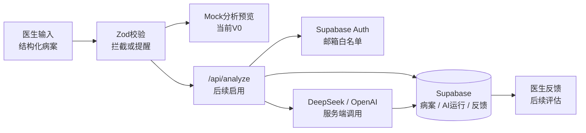

# TCM Diagnosis

> 医生端中医病案分析 · DeepSeek / OpenAI clinical workflow test

A mobile-friendly doctor workbench for structured TCM case review. The first version is a mock dashboard: doctors can load sample cases, enter structured clinical notes, see validation guardrails, view a mock AI analysis, and record feedback.

The goal is not to replace physician judgment. The goal is to test whether AI can produce **consistent, practical, simplified-Chinese clinical decision-support drafts** for registered TCM doctors, especially in a Singapore clinic context.

---

## Current Status

V0 is a working mock UI only.

- Chinese-only product UI and mock clinical data
- Structured case form
- Required / recommended / optional field labels
- Validation guardrails with educational reminders
- Two sample cases: PCOS formula review and trigger finger acupuncture plan
- Mock AI output sections
- Prompt architecture file with modular Chinese prompt sections
- Unit tests for validation rules
- GitHub Actions CI for lint, test, and build

Real Supabase auth/storage and DeepSeek/OpenAI calls are planned next.

---

## Stack

| Layer | Technology |
|---|---|
| App | Next.js + TypeScript |
| UI | Chakra UI, custom CSS, lucide-react |
| Validation | Zod |
| Forms | react-hook-form installed for next form refactor |
| Tests | Vitest |
| Database/Auth | Supabase planned |
| AI | DeepSeek planned first, OpenAI planned as second provider |
| Deploy | Vercel |

---

## Development

```bash
npm install
npm run dev
npm run lint
npm run test
npm run build
```

Open:

```text
http://localhost:3000
```

Windows PowerShell may block `npm.ps1`; use `npm.cmd` if needed:

```bash
npm.cmd run dev
```

---

## Environment

Copy `.env.local.example` to `.env.local` when wiring real services.

```env
NEXT_PUBLIC_SUPABASE_URL=https://gegeuztvzecsikhxcvgl.supabase.co
NEXT_PUBLIC_SUPABASE_ANON_KEY=your_supabase_anon_key_here
DEEPSEEK_API_KEY=your_deepseek_api_key_here
DEEPSEEK_MODEL=deepseek-v4-flash
```

Never expose server keys in frontend env names:

- No `NEXT_PUBLIC_DEEPSEEK_*`
- No `NEXT_PUBLIC_SUPABASE_SERVICE_ROLE_KEY`

---

## Architecture Direction



Prompt modules live in:

```text
src/lib/ai/prompts.ts
```

Validation rules live in:

```text
src/lib/caseValidation.ts
```

---

## Product Invariants

- Chat with the project owner in English; product UI/data/output use simplified Chinese.
- Doctor-facing only, not patient-facing.
- Do not promise cure or guaranteed efficacy.
- Prefer practical Singapore clinic recommendations over theoretical maximalism.
- Similar inputs should produce similar core recommendations.
- Store prompt version, model, input, output, validation result, blocked reason, and doctor feedback once real storage is enabled.
- Missing information should usually trigger helpful reminders, not hard blocks, unless minimum safe context is missing.
- Do not fabricate citations. Evidence retrieval is a later phase.

---

## Tests

```bash
npm run test
```

Current coverage focuses on clinical validation rules:

- complete formula case passes
- formula case without herbs blocks
- acupuncture case without treatment details blocks
- missing age/sex/duration gives reminders, not blocks
- vague doctor questions block
- guaranteed efficacy wording blocks
- patient self-use wording blocks

CI runs:

```text
npm run lint
npm run test
npm run build
```
