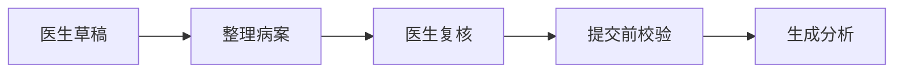
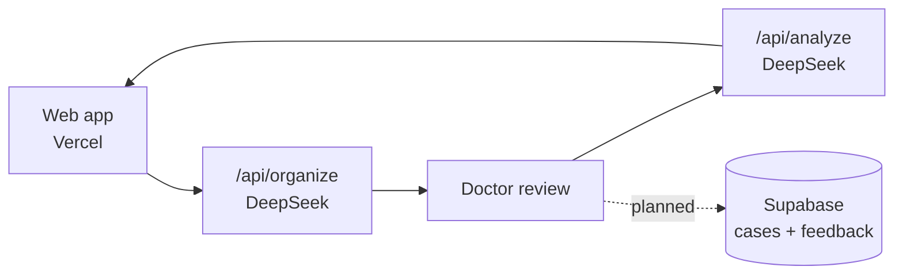

# TCM Diagnosis

> 医生端中医病案分析 · DeepSeek workflow test

Turn rough TCM consultation notes into a structured case, let the doctor review the details, then generate a practical clinical analysis draft in simplified Chinese.

This is a doctor-facing prototype for testing whether DeepSeek can support TCM physicians with more consistent, realistic, and practical case analysis. The focus is Singapore clinic use: clear suggestions, reasonable complexity, medicine/material availability, safety reminders, and no guaranteed claims.

---

## What It Does

Current flow:

1. Doctor writes a rough case draft.
2. DeepSeek organizes it into structured fields.
3. Doctor reviews and edits the structure.
4. DeepSeek generates the analysis.

The app shows missing required fields clearly, gives gentle reminders for useful-but-missing context, and keeps the workflow simple enough for quick clinical testing.



---

## Stack

| Layer | Technology |
|---|---|
| Frontend | Next.js + TypeScript |
| UI | Chakra UI, custom CSS, lucide-react |
| AI | DeepSeek |
| Validation | Zod |
| Tests | Vitest |
| Deploy | Vercel |
| Database/Auth | Supabase planned |

---

## APIs & Services

| API / Service | Purpose | Cost |
|---|---|---|
| DeepSeek | Draft organization + clinical analysis | Pay per token |
| Supabase | Auth + case storage, planned next | Free tier / paid tiers |
| Vercel | Web app hosting + server routes | Free tier / paid tiers |

---

## Architecture

The first version keeps the workflow small: two AI calls, with doctor review between them.



---

## Development

```bash
npm install
npm run dev
npm run lint
npm run test
npm run build
```

DeepSeek smoke test:

```bash
npm run check:deepseek
```

Tests cover validation rules, cost estimation, and build safety. CI runs lint, tests, and build on every push.

## Debugging

Server errors can be logged to Supabase once `supabase/error_logs.sql` is run and `SUPABASE_SERVICE_ROLE_KEY` is configured in Vercel/local env. Without that key, errors fall back to server console logs.
