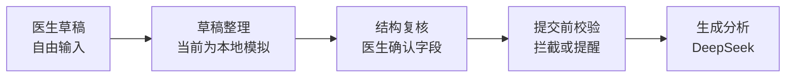
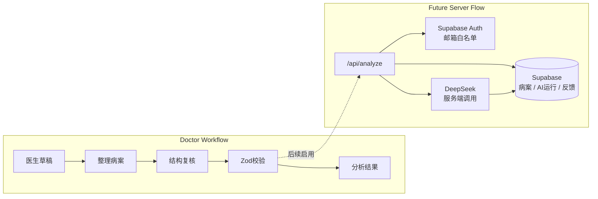

# TCM Diagnosis

> 医生端中医病案分析 · DeepSeek clinical workflow test

Write rough TCM case notes, let AI organize them into structured fields, review the structure, then generate a practical simplified-Chinese clinical analysis draft.

The app is **doctor-facing only**. It is designed to test whether LLMs can produce consistent, realistic, Singapore-clinic-friendly decision-support drafts for registered TCM physicians. It does not replace physician judgment.

---

## Current Flow

V0 now has server-side DeepSeek API routes for draft organization and analysis. Supabase auth/storage is still planned.



Core product principle: doctors should be able to start with a brain dump, not a large form.

---

## Stack

| Layer | Technology |
|---|---|
| App | Next.js + TypeScript |
| UI | Chakra UI, custom CSS, lucide-react |
| Validation | Zod |
| Forms | react-hook-form installed for next form refactor |
| Tests | Vitest |
| Auth / Database | Supabase planned |
| AI | DeepSeek |
| Deploy | Vercel |

---

## APIs & Services

| Service | Purpose | Status |
|---|---|---|
| DeepSeek | Draft organization + clinical analysis | Active server routes |
| Supabase Auth | Google OAuth + allowed doctor emails | Planned |
| Supabase Postgres | Cases, AI runs, validation logs, feedback | Planned |
| Vercel | Hosting + server routes | Active |
| PubMed / TCM sources | Evidence retrieval layer | Later phase |

---

## Architecture



Prompt modules:

```text
src/lib/ai/prompts.ts
```

Validation rules:

```text
src/lib/caseValidation.ts
```

---

## Development

```bash
npm install
npm run dev
npm run lint
npm run test
npm run build
```

Open:

```text
http://localhost:3000
```

On Windows PowerShell, use `npm.cmd` if `npm.ps1` is blocked:

```bash
npm.cmd run dev
```

---

## Environment

Copy `.env.local.example` to `.env.local` when real services are wired.

```env
NEXT_PUBLIC_SUPABASE_URL=https://gegeuztvzecsikhxcvgl.supabase.co
NEXT_PUBLIC_SUPABASE_ANON_KEY=your_supabase_anon_key_here
DEEPSEEK_API_KEY=your_deepseek_api_key_here
DEEPSEEK_MODEL_FAST=deepseek-v4-flash
DEEPSEEK_MODEL_DEEP=deepseek-v4-pro
```

Never expose server secrets with `NEXT_PUBLIC_`:

```text
NEXT_PUBLIC_DEEPSEEK_API_KEY      # wrong
NEXT_PUBLIC_SUPABASE_SERVICE_ROLE # wrong
```

---

## Invariants

- Product UI, validation messages, stored labels, and AI output use simplified Chinese.
- Project discussion with the owner can be in English.
- Doctor-facing only, not patient-facing.
- The workflow is draft-first: 草稿整理 → 结构复核 → 生成分析.
- Missing context should usually produce helpful reminders, not hard blocks.
- Hard-block vague, unsafe, patient-facing, or guaranteed-cure requests.
- Prefer practical Singapore clinic recommendations over theoretical maximalism.
- Similar inputs should produce similar core recommendations.
- Do not fabricate citations. Evidence retrieval is a later phase.

---

## Testing

```bash
npm run test
```

Current tests cover validation rules:

| Scenario | Expected |
|---|---|
| Complete formula case | Pass |
| Formula case without herbs | Block |
| Acupuncture case without treatment details | Block |
| Missing age / sex / duration | Reminder only |
| Vague doctor question | Block |
| Guaranteed efficacy wording | Block |
| Patient self-use wording | Block |

CI runs on GitHub Actions:

```text
npm run lint
npm run test
npm run build
```
