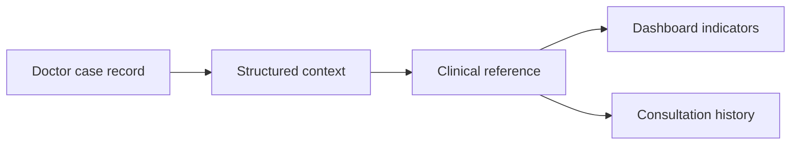
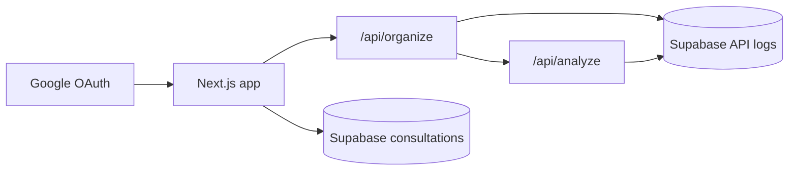

# TCM Diagnosis

Doctor-facing TCM clinical workbench for organizing case notes, identifying missing clinical context, generating structured Chinese clinical references, and saving consultation review history.

The product is designed for practical Singapore clinic use: concise case review, realistic treatment adjustments, safety reminders, and repeatable clinical reasoning without guaranteed claims.

---

## What It Helps With

1. Registered doctors sign in with Google.
2. A doctor pastes or edits a case record.
3. The system organizes the draft into structured clinical context.
4. DeepSeek generates a simplified-Chinese clinical reference.
5. The dashboard highlights completeness, risks, review points, and suggested priorities.
6. Consultation history can be saved, renamed, reopened, edited, regenerated, and deleted.

---

## Stack And Architecture

| Layer | Technology |
|---|---|
| Web app | Next.js + TypeScript on Vercel |
| UI | Custom CSS + lucide-react |
| AI | DeepSeek via server routes |
| Auth | Supabase Google OAuth + email allowlist |
| Data | Supabase JSONB consultation records + API logs |
| Validation | Zod + focused clinical guardrails |
| Checks | Vitest + production build |

---

## Backend API Routes

| Route | Purpose |
|---|---|
| `POST /api/organize` | Organize a doctor draft into structured case data. |
| `POST /api/analyze` | Generate clinical reference output. |
| `GET /api/consultations` | List consultation history for the logged-in doctor. |
| `POST /api/consultations` | Create a consultation record. |
| `GET /api/consultations/[id]` | Read one owned consultation record. |
| `PATCH /api/consultations/[id]` | Rename, edit, mark status, and store JSON analysis data. |
| `DELETE /api/consultations/[id]` | Delete one owned consultation record. |
| `GET /auth/callback` | Complete Google OAuth and allowlist check. |
| `GET /auth/signout` | Sign out and return to login. |
