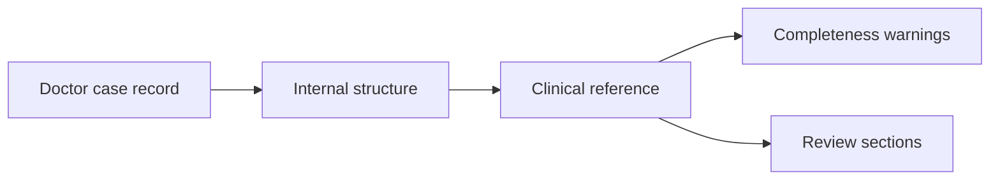
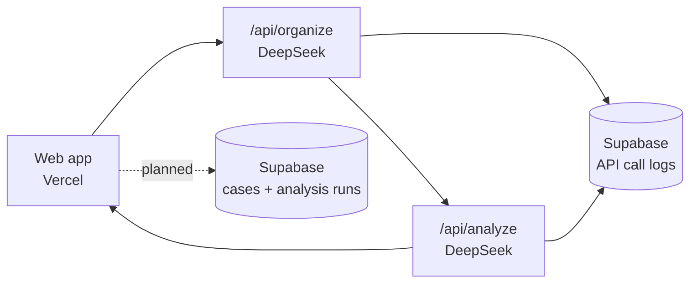

# TCM Diagnosis

> Doctor-facing TCM case review workbench · DeepSeek prototype

This project tests whether an AI workflow can help TCM doctors review real clinic notes more consistently. The app is intentionally small: paste a case record, run clinical review, then compare the original note with structured AI output in simplified Chinese.

The focus is practical Singapore clinic use: missing context, realistic treatment complexity, medicine/material availability, safety reminders, and no guaranteed claims.

---

## What It Does

Current flow:

1. Doctor pastes a case record.
2. DeepSeek organizes the note internally.
3. DeepSeek generates a clinical reference.
4. The page keeps the original note on top and shows the analysis below for comparison.



The output is grouped for clinical review:

- 资料完整性
- 病案摘要
- 临床判断
- 建议方案
- 复核与随访
- 临床风险

---

## Stack

| Layer | Technology |
|---|---|
| Frontend | Next.js + TypeScript |
| UI | Custom CSS + lucide-react |
| AI | DeepSeek |
| Validation | Zod |
| Tests | Vitest |
| Deploy | Vercel |
| Logging | Supabase |

---

## Storage Status

Currently saved:

- API route
- provider
- model
- success/failure
- latency
- token usage
- estimated cost
- prompt version
- error message
- small metadata such as case type, draft length, JSON repair status

Not yet saved:

- full doctor draft
- structured extracted case
- final analysis JSON
- doctor feedback
- accepted/rejected suggestions
- doctor email

Next database step: add `clinical_cases` and `analysis_runs`, then link feedback to each run.

---

## Architecture



---

## Development

```bash
npm install
npm run dev
npm run test
npm run build
```

DeepSeek smoke test:

```bash
npm run check:deepseek
```

Use checks pragmatically. For UI/routes, `npm run build` is usually enough before push. Run unit tests when validation, JSON handling, or prompt parsing changes.

## Debugging

`supabase/error_logs.sql` stores server errors.

`supabase/api_call_logs.sql` stores model-call performance and cost details. Use this table to compare latency, model choice, token usage, JSON repair frequency, and failed runs.
